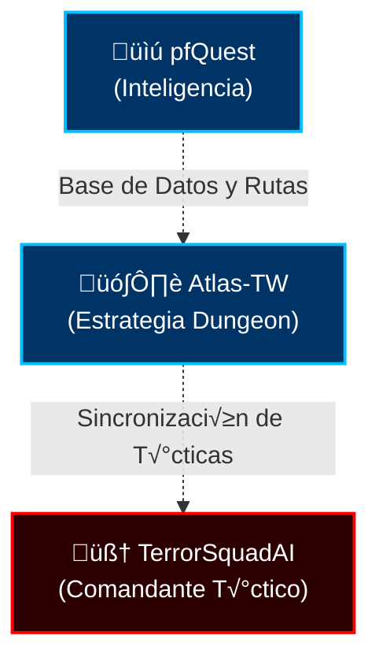

# Atlas‑TW — v9.3.0-TW [God-Tier] Séquito del Terror Edition

Overview: Atlas‚ÄëTW is a dungeon map browser with an integrated loot panel and quests module. It is compatible with World of Warcraft 1.12 and includes localization support.

1) Compatibility and Requirements
- Client: WoW 1.12 (Interface: 11200)
- Addon folder: Interface\AddOns\Atlas-TW
- Saved variables:
  - Account-wide: AtlasTWOptions
  - Per-character: AtlasTWCharDB
- Optional dependencies (detected if installed): EquipCompare, EQCompare, pfQuest, pfUI

2) Installation
- Copy the Atlas‚ÄëTW folder to Interface\AddOns
- Enable the addon on the character selection screen

3) Quick Start and Controls
- Open/Close Atlas‚ÄëTW: /atlas
- Open options: /atlas options (or /atlas opt)
- Minimap button (if enabled):
  - Left-click — open Atlas‑TW
  - Middle-click — open Atlas‑TW options
  - Right-click + drag — move the button
- The AtlasTW window can be dragged when unlocked (lock button on the frame)
- Right-click on the AtlasTW window (if enabled) — close AtlasTW and open the World Map

4) Key Features
- Instance maps with drop-downs:
  - Top-left: category (map type) selection
  - Next to it: instance list
- Auto-select map based on the current zone (Auto‚ÄëSelect option)
- Adjustable Scale and Transparency for the AtlasTW window
- Clamp window to the screen
- Loot panel (bottom panel):
  - Sections: Dungeons & Raids, Collections, Factions, PvP Rewards, Crafting, World Events, Rare Mobs
  - Search, presets, quick navigation
  - **pfQuest Integration**:
    - Right-click on a item to search for it in the pfQuest database
- Quests module:
  - Side panel with instance quests
  - In‚ÄëAtlas details panel with story/rewards
  - Faction toggle (Alliance/Horde), basic availability filtering
  - **pfQuest Integration**:
    - Right-click on a quest in the list to show its starter location on the map
    - Right-click on a quest reward item to search for it in the pfQuest database
- Enhanced item tooltips: adds loot source at the end of the tooltip and integrates with compare addons if enabled
- Optional: cursor coordinates overlay on the default World Map (toggle in options)

5) Window and UI Elements
- Main frame: AtlasTWFrame
- Drop-downs:
  - Map Type (category)
  - Instance selection
- Top buttons:
  - Lock/Unlock — toggle window movement
  - Options — open Atlas‑TW options
  - Quests — show/hide quests panel
  - Loot Panel — show/hide bottom loot panel
- Loot panel: section buttons and items area with scrolling
- Quests panel: quest counter, quest entries, faction buttons, "Story" button

6) Options (highlights)
- Show Button on Minimap — show the minimap button
- Auto‑Select Instance Map — auto-select instance map by current zone
- Right‑Click for World Map — right-click closes Atlas and opens the World Map
- Show Acronyms — show instance acronyms
- Clamp window to screen — keep the window within the screen
- Transparency — Atlas window transparency
- Scale — Atlas window scale
- Show Loot Panel with AtlasTW — show the bottom loot panel
- Quests — embed the quests panel into the Atlas window
- Show cursor coordinates on World Map — toggle AtlasTWOptions.AtlasCursorCoords

7) Commands
- /atlastw — toggle Atlas‑TW window
- /atlastw options (or /atlastw opt) — open options
- /atlastw ver — print your local Atlas‑TW version to chat
- /atlastw ver check — immediately publish your version to LFT and print confirmation

8) First Run
- On the first run, a setup prompt may be shown once
- AtlasTWCharDB.FirstTime controls the one‚Äëtime greeting behavior

9) FAQ
- The window is invisible
  - Check Scale/Transparency in options
  - Type /atlastw
- Minimap button is missing
  - Enable "Show Button on Minimap" in options
- Right‚Äëclick opens the World Map
  - Disable "Right‚ÄëClick for World Map"
- No quests for the instance
  - Check your faction (Alliance/Horde)
  - Some instances may have no quests

10) Tips
- Auto‚Äëselect is handy when farming: the correct map opens automatically when you enter an instance
- For item comparison, enable the appropriate tooltip integration (EquipCompare)
- Hide the loot panel temporarily to save space inside the Atlas window

11) Localization
- Atlas-TW uses a modular localization system based on namespaces
- Structure:
  - `Locales/LocalizationFramework.lua` — Core localization system
  - `Locales/[locale]/` — Language-specific files (enUS, deDE, esES, ptBR, zhCN)
  - Each locale has 9 modules: Core, Zones, Bosses, Classes, Factions, Spells, ItemSets, MapData, QuestData
- Automatic fallback to English for missing translations
- To add/update translations: edit the corresponding file in `Locales/[locale]/`

12) Technical Details
- No external Babble libraries required (replaced by modular system)
- All localization data is loaded via `Locales/locales.xml`
- Fully synchronized with `DarckRovert/AtlasTW-TurtleWoW-El-Sequito-del-Terror-Edition` v1.50 (Turtle WoW 1.18.1)

### 🌐 Séquito Ecosystem Compatible (SquadMind)
`Atlas-TW` ahora sirve como el **Mapa T√°ctico** de la Red Neural de 10 addons del clan. 

- **Simbiosis con pfQuest**: Permite hacer clic derecho en ítems de Loot de Atlas-TW para ver directamente en el mapa (vía pfQuest) dónde cae, qué misiones lo requieren o qué lo dropea.
- **Simbiosis con TerrorSquadAI**: Atlas-TW no es solo consultivo; sincroniza los waypoints de jefes y estrategias de raid con **TerrorBoard** (Pizarra holográfica de TSAI) para una navegación táctica perfecta por las mazmorras del Séquito.

## Turtle WoW Compatibility & Patch 1.18.1 (March 2026)

This version includes specific fixes and data updates for Turtle WoW:

**Updated by**: DarckRovert (Elnazzareno - El Sequito del Terror)

### Latest 1.18.1 Support:
- **New Zones**: Full data for *Moonwhisper Coast* and *Thorn Gorge*.
- **Faction Rewards**: Complete loot tables for the *Draenei Exiles* faction.
- **Instance Data**: Updated loot and boss information for *Naxxramas*, *Onyxia's Lair*, and *Blackwing Lair*.
- **Crafting System**: Split menus by skill tier (Apprentice to Artisan) with new recipes for *Survival* and *Jewelcrafting*.
- **Synchronization**: Fully synced with the official `DarckRovert/AtlasTW-TurtleWoW-El-Sequito-del-Terror-Edition` (v1.50) core.

For more details, see:
- **CHANGELOG_TURTLEWOW.md** - Full technical changelog (English)
- **CREDITOS_ES.md** - Full technical changelog (Spanish)
- **LEEME.md** - Spanish README

Feedback
- Report bugs and requests: which maps/quests/rewards are incorrect, your client language, and client version
---

## ?? Comunidad y Gobernanza

Este proyecto es parte del ecosistema **El SÈquito del Terror**. Nos comprometemos a mantener un ambiente sano y profesional:

- ?? **[CÛdigo de Conducta](./CODE_OF_CONDUCT.md)**: Nuestras normas de convivencia.
- ?? **[GuÌa de ContribuciÛn](./CONTRIBUTING.md)**: CÛmo ayudar a expandir este addon.
- ??? **[Licencia](./LICENSE)**: Este proyecto est· bajo la Licencia MIT.

---
